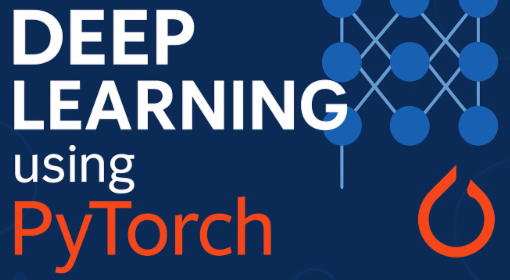

<div align="center">



# Formation avancée en Deep Learning avec PyTorch
### Computer Vision & Séries temporelles

[](https://www.python.org/)
[](https://pytorch.org/)
[](https://jupyter.org/)
[](#licence)

*Bassem Ben Hamed — ENETCOM, Université de Sfax*

</div>

---

## Aperçu

Ce dépôt rassemble le **matériel pédagogique** d'une formation avancée en Deep Learning
appliquée à la **Computer Vision** et aux **séries temporelles**, entièrement basée sur
**PyTorch**. Il combine deux supports complémentaires :

- des **présentations** (slides) couvrant la théorie de chaque module ;
- des **travaux pratiques** (notebooks Jupyter) couvrant l'implémentation, l'entraînement
  et l'évaluation, sur des **cas d'usage réels** (principalement médicaux et industriels).

La progression va des réseaux denses (MLP) aux architectures les plus récentes
(Vision Transformers, modèles de diffusion), en passant par les CNN, le transfer learning,
les réseaux récurrents et l'explicabilité (XAI).

## Programme

| Module | Thèmes | Statut |
|--------|--------|--------|
| **Module 1** | Fondations PyTorch · MLP · CNN (data augmentation, VGG-like *from scratch*) | ✅ Disponible |
| **Module 2** | Transfer Learning & Fine-tuning · RNN/LSTM/GRU (séries temporelles) · Explicabilité (Grad-CAM, IG, SHAP, LIME, Captum) | ✅ Disponible |
| **Module 3** | Autoencoders · VAE · Modèles de Diffusion (DDPM / DDIM) | 🚧 En développement |
| **Module 4** | GAN (DCGAN, cGAN, Pix2Pix, SRGAN) · Vision Transformers (ViT, Swin, SegFormer) · Déploiement (TorchScript / ONNX) · Projet final | 🚧 En développement |

## Structure du dépôt

```
.
├── slides/                  # Présentations (PDF)
│   ├── 00_plan_formation.pdf
│   ├── 01_module1_pytorch_mlp_cnn.pdf
│   └── 02_module2_transfer_rnn_xai.pdf
├── tp/                      # Travaux pratiques (notebooks Jupyter)
│   ├── module_1/            # 01 PyTorch · 02 MLP · 03 CNN (DermaMNIST)
│   ├── module_2/            # 04 Transfer Learning · 05 RNN/LSTM/GRU · 06 XAI
│   ├── module_3/            # 07–09 (à venir)
│   └── module_4/            # 10–13 (à venir)
├── requirements.txt
└── README.md
```

Chaque dossier `tp/module_*/` contient son propre `README.md` détaillé, un cache `data/`
(jeux de données **téléchargés automatiquement**, jamais versionnés) et un dossier
`checkpoints/` pour les modèles entraînés.

## Setup

### 1. Installer Anaconda

Téléchargez et installez la distribution **Anaconda** (Python 3) depuis le site officiel :
👉 <https://www.anaconda.com/download>

Vérifiez l'installation dans un terminal :

```bash
conda --version
```

### 2. Créer et activer un environnement dédié

```bash
conda create -n dl-pytorch python=3.10 -y
conda activate dl-pytorch
```

### 3. Installer les dépendances

```bash
pip install -r requirements.txt
```

> **GPU (optionnel mais recommandé).** Le `torch` installé via `requirements.txt` fonctionne
> sur CPU. Pour profiter d'un GPU NVIDIA, installez la *build* CUDA correspondante en suivant
> les instructions de <https://pytorch.org/get-started/locally/>, par exemple :
> ```bash
> pip install torch torchvision --index-url https://download.pytorch.org/whl/cu121
> ```

### 4. Lancer les notebooks

```bash
python -m ipykernel install --user --name dl-pytorch --display-name "Python (dl-pytorch)"
jupyter lab
```

Ouvrez ensuite un notebook dans `tp/module_*/` et sélectionnez le kernel
**Python (dl-pytorch)**.

## Utilisation

- **Présentations** : ouvrez les PDF du dossier `slides/`.
- **Travaux pratiques** : suivez l'ordre de numérotation (01 → 13). Au sein d'un module,
  les notebooks se suivent ; certains réutilisent les résultats du précédent (par ex. le TP
  d'explicabilité audite le modèle entraîné au TP de transfer learning).

## Jeux de données

Aucun jeu de données n'est versionné dans ce dépôt. Tous sont **téléchargés automatiquement**
à la première exécution et mis en cache localement (`tp/module_*/data/`) :

- **Vision** — DermaMNIST, PneumoniaMNIST (via [MedMNIST](https://medmnist.com/)).
- **Séries temporelles** — UCI HAR, ETT (ETTh1), AI4I 2020 (sources officielles).

## Auteur

**Bassem Ben Hamed**
ENETCOM — Université de Sfax
📧 `bassem.benhamed@enetcom.usf.tn`

## Licence

Matériel pédagogique destiné à un usage **éducatif**. © Bassem Ben Hamed. Merci de citer
l'auteur en cas de réutilisation.
